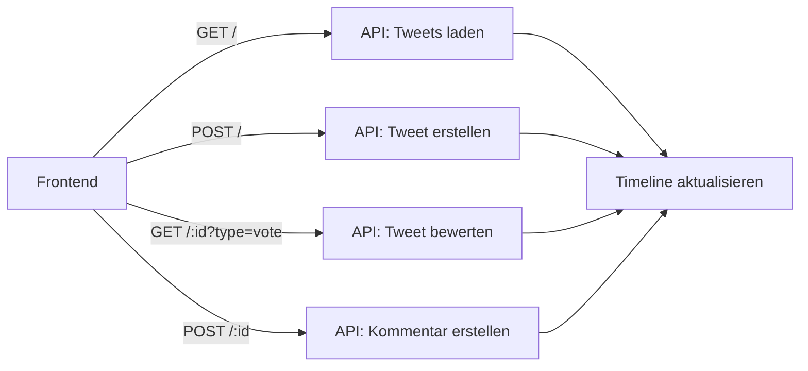

# 🌋 Chroniken von Mordor - Lord of the Tweets

> *"Ein Tweet, sie zu knechten, sie alle zu finden, ins Dunkel zu treiben und ewig zu binden."*

Eine Twitter-ähnliche Anwendung im Stil von "Der Herr der Ringe" - entwickelt als kreative Interpretation einer sozialen Media-Plattform in Mittelerdes düsterer Atmosphäre.

## 📋 Inhaltsverzeichnis

- [🌋 Projektübersicht](#-projektübersicht)
- [✨ Features](#-features)
- [🛠 Installation & Setup](#-installation--setup)
- [📁 Projektstruktur](#-projektstruktur)
- [🔌 API-Dokumentation](#-api-dokumentation)
- [👥 Benutzerhandbuch](#-benutzerhandbuch)
- [💻 Entwickler-Guidelines](#-entwickler-guidelines)
- [⚙️ Technische Spezifikationen](#️-technische-spezifikationen)
- [🚀 Deployment](#-deployment)
- [🤝 Contributing](#-contributing)

## 🌋 Projektübersicht

"Chroniken von Mordor" ist eine Twitter-ähnliche Webanwendung, die vollständig im Universum von J.R.R. Tolkiens "Der Herr der Ringe" angesiedelt ist. Benutzer können als Bewohner Mittelerdes ihre Gedanken und Nachrichten teilen, auf andere reagieren und in einer atmosphärischen LOTR-Umgebung interagieren.

### 🎯 Hauptziele

- **Benutzerfreundlichkeit**: Intuitive Twitter-ähnliche Bedienung
- **LOTR-Immersion**: Vollständige thematische Integration von Herr der Ringe
- **Moderne Technologie**: Einsatz aktueller Webtechnologien und -standards
- **Responsive Design**: Optimale Darstellung auf allen Geräten
- **Kreative Features**: Einzigartige Funktionen wie Orkisch-Übersetzer

### 🏆 Projektkontext

Dieses Projekt entstand als **kreative Projektaufgabe** mit dem Ziel, eine funktionsfähige Twitter-Alternative zu entwickeln, die sowohl technische Kompetenz als auch kreative Gestaltung demonstriert.

## ✨ Features

### 🏛️ Kernfunktionalitäten

- **📝 Tweet-Erstellung**: Neue Nachrichten mit Benutzer und Text verfassen
- **📱 Timeline**: Alle Tweets in ansprechendem, responsivem Grid-Layout
- **👍 Bewertungssystem**: "Aufheizen 🔥" (Upvote) und "Verfluchen 💀" (Downvote)
- **💬 Kommentarsystem**: Detaillierte Diskussionen unter jedem Tweet
- **🔄 Sortierung**: Nach Popularität ("Machtvoll") oder Aktualität ("Brandneu")
- **🗣️ Orkisch-Übersetzer**: Einzigartige LOTR-Feature zur Sprachübersetzung
- **📱 Responsive Design**: Perfekte Darstellung auf Desktop, Tablet und Mobile

### 🎭 LOTR-Thematische Features

- **🎨 Atmosphärisches Design**: Pergament-ähnlicher Hintergrund mit mittelalterlicher Ästhetik
- **✍️ Thematische Fonts**: Ringbearer-Schriftart für authentisches Mittelerde-Feeling
- **🗣️ Orkische Übersetzung**: Tweets können in eine orkische Fantasiesprache übersetzt werden
- **🎪 Thematische UI-Texte**: "Dem Dunklen Herrscher melden", "Machtvoll", "Verfluchen"
- **🌈 Farbschema**: Gold-Beige-Dunkel Palette inspiriert von Herr der Ringe

### 📱 Technische Features

- **⚡ Real-time Updates**: Sofortiges Laden neuer Tweets und Kommentare
- **💾 Local Storage**: Speicherung von Benutzer-Präferenzen (Sortierung)
- **🔒 XSS-Schutz**: Sichere Behandlung von Benutzer-Input
- **🌐 API-Integration**: RESTful Backend-Kommunikation
- **⏰ Zeit-Formatierung**: Deutsche Zeitangaben mit Moment.js

## 🛠 Installation & Setup

### 📋 Voraussetzungen

- **Browser**: Moderner Webbrowser (Chrome 80+, Firefox 75+, Safari 13+, Edge 80+)
- **Internet**: Aktive Internetverbindung für CDN-Abhängigkeiten und API-Zugriff
- **Optional**: Lokaler HTTP-Server für optimale Performance

### 🚀 Schnellstart

1. **Repository klonen**:
   ```bash
   git clone https://github.com/Code-Crusader-X/Lord-of-the-Tweets.git
   cd Lord-of-the-Tweets
   ```

2. **Lokalen Server starten** (empfohlen):
   ```bash
   # Python (meistens vorinstalliert)
   python -m http.server 8000
   
   # Node.js
   npx serve .
   
   # PHP
   php -S localhost:8000
   ```

3. **Browser öffnen**: `http://localhost:8000`

4. **Alternative**: `index.html` direkt im Browser öffnen

### 🔗 CDN-Abhängigkeiten

Das Projekt nutzt folgende externe Bibliotheken:
- **Bootstrap 5.1.3**: CSS-Framework und JavaScript-Components
- **jQuery 3.6.0**: DOM-Manipulation und AJAX-Requests
- **Moment.js 2.29.1**: Zeitformatierung und deutsche Lokalisierung
- **Ringbearer Font**: Spezielle LOTR-Schriftart via CDN

## 📁 Projektstruktur

```
Lord-of-the-Tweets/
├── 📄 index.html          # Haupt-HTML-Datei mit App-Struktur
├── 📜 script.js           # JavaScript-Hauptlogik (Twitter-Funktionalität)
├── 🎨 styles.css          # LOTR-themiges Custom CSS
├── ⏰ moment.min.js       # Moment.js Bibliothek (lokale Kopie)
├── 📚 README.md           # Projektdokumentation (diese Datei)
└── 🔧 .gitignore          # Git-Konfiguration
```

### 📄 Datei-Details

#### `index.html` - HTML-Struktur
```html
<!-- Haupt-Features: -->
- Responsive Meta-Tags und Bootstrap-Integration
- Tweet-Erstellungsformular mit thematischen Placeholders
- Sortier-Dropdown für Timeline-Kontrolle
- Posts-Container für dynamische Tweet-Anzeige
- CDN-Einbindungen für alle externen Dependencies
```

#### `script.js` - JavaScript-Logik
```javascript
// Hauptkomponenten:
- API-Integration mit nafra.at Backend
- Tweet-Management (Laden, Erstellen, Bewerten)
- UI-Interaktionen (Sortierung, Kommentare, Orkisch-Übersetzer)
- Event-Handler für alle Benutzer-Aktionen
- Utility-Funktionen (HTML-Escaping, Zeit-Formatierung)
```

#### `styles.css` - LOTR-Styling
```css
/* Design-Komponenten: */
- CSS Custom Properties für konsistentes Theming
- Responsive Grid-Layout (3/2/1 Spalten)
- LOTR-inspirierte Farbpalette und Typographie
- Tweet-Card Styling mit Pergament-Ästhetik
- Mobile-optimierte Komponenten
```

## 🔌 API-Dokumentation

### 🌐 Backend-Service

**Base URL**: `https://www.nafra.at/adad_st2025/project/`  
**API-Dokumentation**: [Swagger Docs](https://www.nafra.at/adad_st2025/swagger/)

### 🔐 Authentifizierung

Alle API-Requests benötigen den Authentication-Header:
```javascript
"X-Auth-Token": "a534e63a0d68ad8ec00d"
```

### 📊 API-Endpoints

#### `GET /` - Tweets abrufen
```javascript
// Alle Tweets mit Sortierung laden
$.getJSON("https://www.nafra.at/adad_st2025/project/?sort=popular")

// Parameter:
// sort: "popular" (nach Likes) | "new" (chronologisch)
```

**Response-Struktur**:
```json
[
  {
    "id": 1,
    "user": "Gandalf_der_Graue",
    "text": "Ein Ring, sie zu knechten...",
    "timestamp": "2025-06-23T10:00:00Z",
    "reactions": 42,
    "comments": [
      {
        "user": "Frodo_Beutlin",
        "text": "Interessant, aber beunruhigend!",
        "timestamp": "2025-06-23T10:05:00Z"
      }
    ]
  }
]
```

#### `POST /` - Tweet erstellen
```javascript
// Neuen Tweet veröffentlichen
$.post("https://www.nafra.at/adad_st2025/project/", {
  user: "Benutzername",
  text: "Tweet-Inhalt (max. Zeichen beachten)"
})
```

#### `GET /:id?type=upvote|downvote` - Tweet bewerten
```javascript
// Tweet upvoten (Aufheizen 🔥)
$.get("https://www.nafra.at/adad_st2025/project/1?type=upvote")

// Tweet downvoten (Verfluchen 💀)
$.get("https://www.nafra.at/adad_st2025/project/1?type=downvote")
```

#### `POST /:id` - Kommentar hinzufügen
```javascript
// Kommentar zu spezifischem Tweet erstellen
$.post("https://www.nafra.at/adad_st2025/project/1", {
  user: "Kommentator_Name", 
  text: "Kommentar-Inhalt"
})
```

### 🔄 API-Datenfluss



## 👥 Benutzerhandbuch

### ✍️ Tweet erstellen

1. **Name eingeben**: Im oberen Formular den gewünschten Benutzernamen eingeben
2. **Tweet verfassen**: Text in das Feld "Was gibt's Neues in Mordor?" eingeben
3. **Veröffentlichen**: "Dem Dunklen Herrscher melden" klicken
4. **Bestätigung**: Tweet erscheint automatisch in der Timeline

### 📖 Timeline nutzen

#### 🔄 Sortierung ändern
- **"Machtvoll"**: Tweets nach Anzahl der Upvotes sortiert
- **"Brandneu"**: Tweets chronologisch nach Erstellungszeit

#### 👍 Tweets bewerten
- **"Aufheizen 🔥"**: Positive Bewertung (Upvote)
- **"Verfluchen 💀"**: Negative Bewertung (Downvote)
- Aktuelle Bewertungsanzahl wird in Echtzeit aktualisiert

#### 🗣️ Orkisch-Übersetzer verwenden
1. "Auf Orkisch übersetzen" unter einem Tweet klicken
2. Tweet wird in orkische Fantasiesprache übersetzt
3. "Original anzeigen" klicken zum Zurückwechseln

### 💬 Kommentare

#### Kommentar erstellen
1. Zum gewünschten Tweet scrollen
2. Im Kommentar-Bereich Name und Kommentar eingeben
3. "Kommentieren" klicken
4. Kommentar erscheint sofort unter dem Tweet

#### Kommentare lesen
- Alle Kommentare werden unter jedem Tweet angezeigt
- Zeitstempel zeigen an, wann kommentiert wurde
- Kommentare sind chronologisch sortiert

### 📱 Mobile Nutzung

- **Responsive Layout**: Automatische Anpassung an Bildschirmgröße
- **Touch-optimiert**: Große Buttons für Fingerbedienung
- **Lesbarkeit**: Optimierte Schriftgrößen für mobile Geräte
- **Performance**: Schnelle Ladezeiten auch bei langsamer Verbindung

## 💻 Entwickler-Guidelines

### 📝 Code-Style

#### JavaScript
```javascript
// ES6+ Features verwenden
const loadTweets = () => {
  // Arrow Functions für moderne Syntax
}

// jQuery für DOM-Manipulation
$('#posts-container').on('click', '.btn-praise', function() {
  // Event-Delegation für dynamische Inhalte
});

// Async/Await für API-Calls (wenn möglich)
```

#### CSS
```css
/* CSS Custom Properties für Theming */
:root {
  --gold: #d4af37;
  --beige: #f5e6b2;
}

/* Mobile-First Responsive Design */
@media (max-width: 900px) {
  /* Tablet-Anpassungen */
}
```

#### HTML
```html
<!-- Semantische HTML5-Struktur -->
<main class="container">
  <section id="tweet-creation">
    <!-- Klar strukturierte Bereiche -->
  </section>
</main>
```

### 🔒 Sicherheit

#### XSS-Schutz
```javascript
// Alle User-Inputs escapen
function escapeHtml(text) {
  return text.replace(/[&<>"']/g, c => ({
    '&':'&amp;', '<':'&lt;', '>':'&gt;', 
    '"':'&quot;', '\'':'&#039;'
  }[c]));
}
```

#### API-Sicherheit
```javascript
// Auth-Token in Headers
$.ajaxSetup({ 
  headers: { "X-Auth-Token": "a534e63a0d68ad8ec00d" } 
});
```

#### Input-Validierung
```html
<!-- Client-Side Validation -->
<input type="text" name="user" required maxlength="50">
<textarea name="text" required maxlength="280"></textarea>
```

### ⚡ Performance

#### Optimierungsstrategien
- **CDN-Usage**: Externe Bibliotheken über CDN
- **Event-Delegation**: Effiziente Event-Handler
- **Local Storage**: Caching von User-Präferenzen
- **Debouncing**: Bei häufigen API-Calls

#### Debugging
```javascript
// Development-Modus
const DEBUG = true;

if (DEBUG) {
  console.log('API Response:', data);
  console.log('Current locale:', moment().locale());
}
```

### 🧪 Testing

#### Manuelle Tests
- [ ] Tweet-Erstellung funktioniert
- [ ] Bewertungssystem arbeitet korrekt
- [ ] Kommentare werden gespeichert
- [ ] Responsive Design auf verschiedenen Geräten
- [ ] Orkisch-Übersetzer funktioniert
- [ ] Sortierung wirkt sich auf Timeline aus

#### Browser-Kompatibilität testen
- Chrome (Desktop & Mobile)
- Firefox (Desktop & Mobile)
- Safari (Desktop & Mobile)
- Edge (Desktop)

## ⚙️ Technische Spezifikationen

### 🏗️ Frontend-Technologien

| Technologie | Version | Zweck |
|-------------|---------|--------|
| HTML5 | - | Semantische Struktur |
| CSS3 | - | Styling und Layout |
| JavaScript | ES6+ | Interaktivität und Logik |
| jQuery | 3.6.0 | DOM-Manipulation und AJAX |
| Bootstrap | 5.1.3 | Responsive CSS-Framework |
| Moment.js | 2.29.1 | Zeitformatierung |

### 🎨 Design-System

#### Farbpalette
```css
:root {
  --gold: #d4af37;          /* Primärfarbe - Buttons, Links */
  --gold-dark: #bfa133;     /* Hover-Zustand */
  --beige: #f5e6b2;         /* Haupttext-Farbe */
  --dark: #222;             /* Primärer Hintergrund */
  --dark2: #2d2d2d;         /* Tweet-Card Hintergrund */
  --dark3: #23201a;         /* Kommentar-Bereich */
  --font-main: 'Ringbearer', serif; /* LOTR-Schriftart */
}
```

#### Typographie
- **Haupt-Font**: Ringbearer (LOTR-Thematik)
- **Fallback**: Serif-Fonts für Lesbarkeit
- **Größen**: Responsive Schriftgrößen
- **Spacing**: Optimierte Zeilenhöhen

### 📱 Responsive Design

#### Breakpoints
```css
/* Desktop: > 1024px */
#posts-container {
  grid-template-columns: repeat(3, 1fr);
}

/* Tablet: 900px - 1024px */
@media (max-width: 1024px) {
  #posts-container {
    grid-template-columns: repeat(2, 1fr);
  }
}

/* Mobile: < 900px */
@media (max-width: 900px) {
  #posts-container {
    grid-template-columns: 1fr;
  }
}
```

#### Grid-Layout
- **Desktop**: 3-spaltige Tweet-Anzeige
- **Tablet**: 2-spaltige Tweet-Anzeige  
- **Mobile**: 1-spaltige Tweet-Anzeige
- **Gap**: 2rem zwischen Tweets für optimale Lesbarkeit

### 🌐 Browser-Unterstützung

| Browser | Version | Status |
|---------|---------|--------|
| Chrome | 80+ | ✅ Vollständig unterstützt |
| Firefox | 75+ | ✅ Vollständig unterstützt |
| Safari | 13+ | ✅ Vollständig unterstützt |
| Edge | 80+ | ✅ Vollständig unterstützt |
| Mobile Safari | iOS 13+ | ✅ Vollständig unterstützt |
| Chrome Mobile | Android 8+ | ✅ Vollständig unterstützt |

### ⚡ Performance-Metriken

#### Zielwerte
- **First Contentful Paint**: < 2 Sekunden
- **Time to Interactive**: < 3 Sekunden  
- **Bundle Size**: ~200KB (inkl. Dependencies)
- **API Response Time**: < 500ms
- **Mobile Performance Score**: > 90

#### Optimierungen
- CDN-basierte Libraries für schnelle Ladezeiten
- Minimaler JavaScript-Code für bessere Performance
- Optimierte Bilder und Assets
- Effiziente CSS-Selektoren

## 🚀 Deployment

### 🌐 Statisches Hosting

Das Projekt ist vollständig statisch und kann auf jeder Hosting-Plattform deployed werden:

#### Empfohlene Plattformen
- **GitHub Pages**: Kostenfrei, direkte Git-Integration
- **Netlify**: Erweiterte Features, CDN
- **Vercel**: Optimiert für Frontend-Projekte
- **Firebase Hosting**: Google-Integration

#### Deployment-Schritte

1. **GitHub Pages**:
   ```bash
   # In Repository-Settings "Pages" aktivieren
   # Source: Deploy from branch "main"
   # Automatische URL: https://code-crusader-x.github.io/Lord-of-the-Tweets/
   ```

2. **Netlify**:
   ```bash
   # Drag & Drop Deployment oder Git-Integration
   # Automatische Domain-Generierung
   # Optional: Custom Domain konfigurieren
   ```

### ⚙️ Konfiguration

#### Keine Build-Schritte erforderlich
- Direktes Deployment der Source-Files
- Alle Dependencies via CDN geladen
- Keine Transpilation oder Bundling nötig

#### Umgebungsvariablen
```javascript
// Für verschiedene Umgebungen
const API_BASE_URL = window.location.hostname === 'localhost' 
  ? 'https://www.nafra.at/adad_st2025/project/'
  : 'https://www.nafra.at/adad_st2025/project/';
```

### 🔧 Maintenance

#### Updates
- Regelmäßige Überprüfung der CDN-Dependencies
- Bootstrap und jQuery Updates testen
- API-Kompatibilität überwachen

#### Monitoring
- Performance-Monitoring mit Browser DevTools
- Error-Tracking über Console-Logs
- User-Feedback für UX-Verbesserungen

## 🤝 Contributing

### 🎯 Contribution-Guidelines

1. **Fork erstellen**: Repository in eigenen Account forken
2. **Feature-Branch**: `git checkout -b feature/amazing-feature`
3. **Entwickeln**: Code schreiben und testen
4. **Committen**: `git commit -m 'Add amazing feature'`
5. **Push**: `git push origin feature/amazing-feature`
6. **Pull Request**: Über GitHub-Interface erstellen

### ✅ Code-Review Kriterien

#### Technische Anforderungen
- [ ] **Deutsche Kommentare**: Alle neuen Code-Kommentare auf Deutsch
- [ ] **LOTR-Thematik**: Beibehalten der Mittelerde-Atmosphäre
- [ ] **Responsive Design**: Funktionsfähigkeit auf allen Geräten testen
- [ ] **Cross-Browser**: Kompatibilität mit unterstützten Browsern
- [ ] **Performance**: Keine Verschlechterung der Ladezeiten

#### Content-Guidelines
- [ ] **UI-Texte**: Thematisch passende Beschriftungen
- [ ] **Farbschema**: Konsistenz mit vorhandenem Design
- [ ] **Benutzerfreundlichkeit**: Intuitive Bedienung
- [ ] **Dokumentation**: README bei größeren Änderungen aktualisieren

### 🐛 Bug Reports

Beim Melden von Bugs bitte folgende Informationen angeben:
- **Browser & Version**
- **Betriebssystem**
- **Schritt-für-Schritt Reproduktion**
- **Erwartetes vs. tatsächliches Verhalten**
- **Screenshots** (falls relevant)

### 💡 Feature Requests

Für neue Features:
- **Use Case beschreiben**: Warum ist das Feature nützlich?
- **LOTR-Thematik**: Wie passt es zum Herr-der-Ringe Thema?
- **Technische Überlegungen**: Machbarkeit mit aktueller Architektur
- **Mockups/Wireframes**: Visual für UI-bezogene Features

## 📄 Lizenz & Credits

### 📜 Projekt-Lizenz
Dieses Projekt ist ein **Bildungs- und Demonstrationsprojekt**. Der Code steht unter MIT-Lizenz zur freien Verwendung für Lernzwecke.

### 🏛️ Rechte-Hinweise
- **"Der Herr der Ringe"**: Alle Rechte gehören J.R.R. Tolkien Estate
- **Ringbearer Font**: Lizenziert für Web-Verwendung
- **Bootstrap**: MIT-Lizenz
- **jQuery**: MIT-Lizenz
- **Moment.js**: MIT-Lizenz

### 🙏 Credits
- **Inspiration**: J.R.R. Tolkien's Mittelerde
- **API-Service**: nafra.at Backend-Services
- **Design-Inspiration**: Twitter/X User Interface
- **Font**: Ringbearer by Pete Klassen

## 🔗 Links & Ressourcen

### 📚 Dokumentation
- **API-Docs**: [Swagger Documentation](https://www.nafra.at/adad_st2025/swagger/)
- **Bootstrap**: [Bootstrap 5.1 Documentation](https://getbootstrap.com/docs/5.1/)
- **jQuery**: [jQuery API Documentation](https://api.jquery.com/)
- **Moment.js**: [Moment.js Documentation](https://momentjs.com/docs/)

### 🛠️ Development Tools
- **HTML Validator**: [W3C Markup Validator](https://validator.w3.org/)
- **CSS Validator**: [W3C CSS Validator](https://jigsaw.w3.org/css-validator/)
- **JavaScript Linter**: [ESLint](https://eslint.org/)
- **Accessibility**: [WAVE Web Accessibility Evaluator](https://wave.webaim.org/)

### 🎨 Design-Ressourcen
- **Color Palette**: Adobe Color, Coolors.co
- **Icons**: Unicode-Emojis, SVG-Icons
- **Fonts**: Google Fonts, CDN Fonts
- **Inspiration**: Dribbble, Behance

---

## 📞 Support & Kontakt

Bei Fragen, Problemen oder Anregungen:

- **GitHub Issues**: [Issues erstellen](https://github.com/Code-Crusader-X/Lord-of-the-Tweets/issues)
- **Email**: (Bei Bedarf über GitHub-Profil)
- **Diskussionen**: GitHub Discussions (falls aktiviert)

---

*"Möge dieses Projekt Ihnen dabei helfen, die dunklen Künste der Webentwicklung zu meistern, so wie der Eine Ring die Macht über alle anderen Ringe besaß!"* 

🌋⚔️📱

---

**Entwickelt mit ❤️ und einer Prise Magie aus Mittelerde**